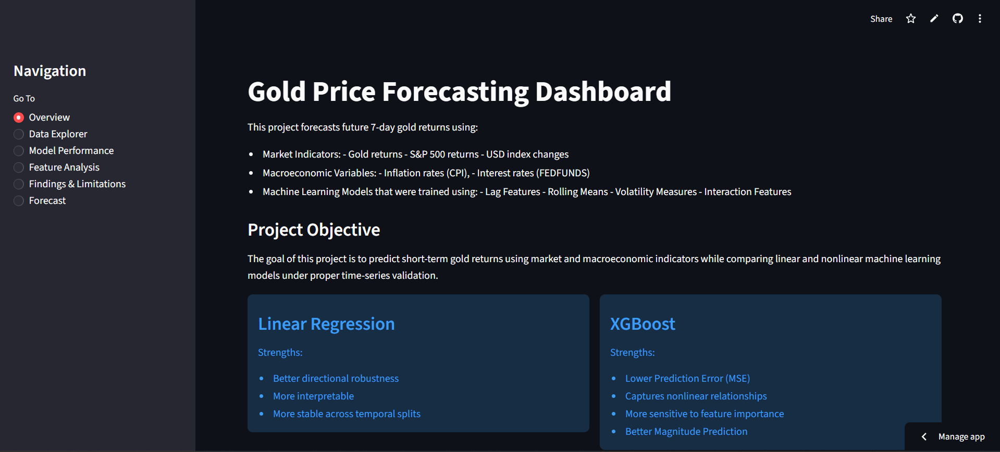
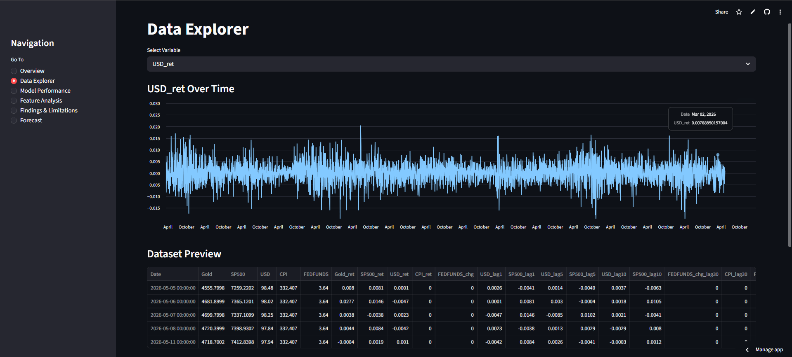
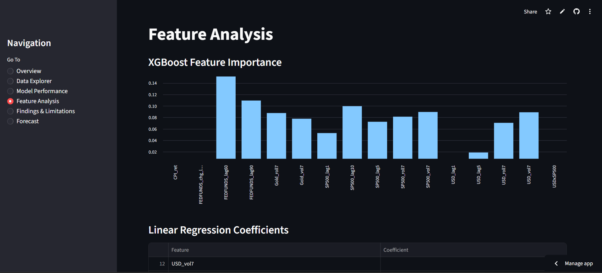

# 📈 Gold Price Forecasting using Machine Learning
A comprehensive data science project and Streamlit dashboard that forecasts 7-day future gold returns using market and macroeconomic features.

**Deployment Link**: [Streamlit App](https://goldpriceforecasting-mv7htjr44btwe6e2z5vh3e.streamlit.app/)

## 📸 Dashboard Screenshots

### Overview


### Data Explorer


### Feature Analysis


## 🎯 Project Objective
The primary goal of this project is to predict short-term (7-day) gold returns using market and macroeconomic indicators. It compares traditional linear methods (Linear Regression) against nonlinear machine learning models (XGBoost) under appropriate time-series validation.

## 📊 Data Sources
The project utilizes financial and macroeconomic datasets sourced from:
- **Yahoo Finance**: Daily market data for Gold, SP500 & USD
- **FRED API**: Macroeconomic indicators including Inflation rates (CPI) and Interest rates (FEDFUNDS).

## 🛠️ Feature Engineering
Feature engineering was applied to prepare the data:
- **Returns**: Calculating period-over-period percentage changes.
- **Lag Features**: Capturing historical patterns and momentum.
- **Rolling Means**: Smoothing out short-term fluctuations.
- **Volatility Measures**: Understanding market turbulence.
- **Interaction Features**: Combining multiple indicators to find complex relationships.

## 🤖 Models & Validation
Two primary models were built, tuned, and evaluated:
1. **Linear Regression:**
   - Strengths: Better directional robustness, highly interpretable, stable across temporal splits.
2. **XGBoost:**
   - Strengths: Lower Prediction Error (MSE), captures nonlinear relationships, better magnitude prediction.

**Validation Strategy:** `TimeSeriesSplit` was utilized to prevent data leakage and evaluate the models in a realistic chronological setting.

## 📁 Project Structure
```text
GOLD_PRICE_FORECASTING/
├── app.py                  # Main Streamlit application
├── README.md               # Project documentation
├── requirements.txt        # Project dependencies
├── data/
│   └── gold_final.csv      # Processed dataset
├── images/                 # Dashboard screenshots
├── models/
│   ├── features.pkl        # Finalized feature list
│   ├── linear_model.pkl    # Trained Linear Regression model
│   └── xgb_model.pkl       # Trained XGBoost model
└── notebooks/
    └── gold_final.ipynb    # Jupyter notebook containing EDA & Model Training
```

## 🚀 Installation & Running Locally
1. **Clone the repository:**
   ```bash
   git clone https://github.com/rahulgandhiii/GOLD_PRICE_FORECASTING.git
   cd GOLD_PRICE_FORECASTING
   ```

2. **Install the dependencies:**
   It is recommended to use a virtual environment.
   ```bash
   pip install -r requirements.txt
   ```

3. **Run the Streamlit Dashboard:**
   ```bash
   streamlit run app.py
   ```
   *The app will automatically open in your default web browser.*

## 💡 Key Findings
1. **Impact of Features**: Feature engineering contributed significantly more to performance gains than increasing model complexity. Market-derived features were inherently more predictive than macroeconomic variables.
2. **Directional Accuracy**: Linear Regression generalized better in terms of predicting the direction correctly.
3. **Error Reduction**: XGBoost effectively reduced overall prediction error (MSE) but didn't drastically improve directional forecasting accuracy over the baseline.
4. **Sensitivity**: Prediction quality varied substantially across different temporal splits, indicating the high sensitivity and difficulty in financial forecasting.

## ⚠️ Limitations & Future Work
- **Weak Signals**: The inherently weak signals in financial environments put a ceiling on predictive performance.
- **Missing Alternative Data**: No sentiment analysis or news data was incorporated; doing so could potentially enhance external event forecasting.
- **Extreme Movements**: Models struggled to predict deep anomalies or extreme market events.
- **Data Composition**: Performance instability across cross-validation splits suggests high sensitivity to the composition of the training data.